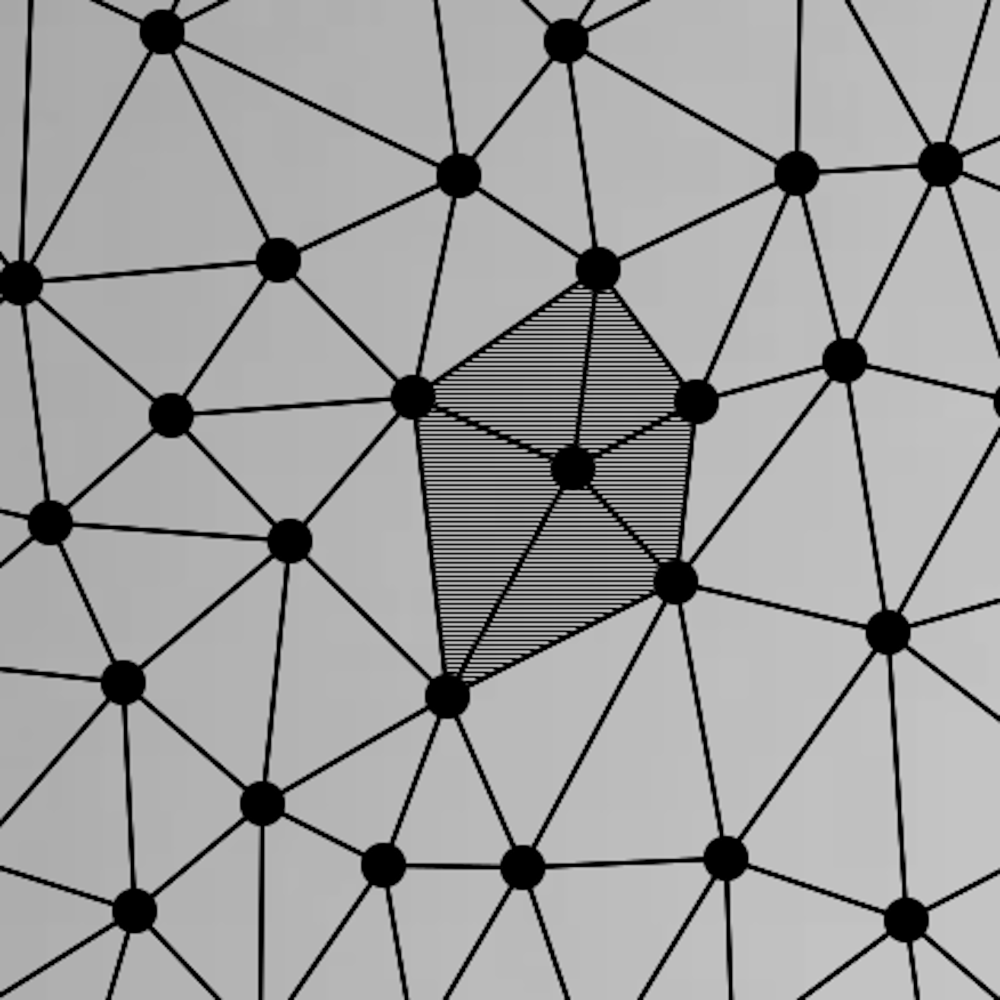
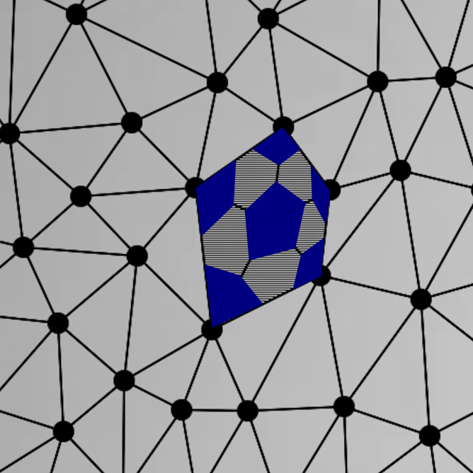
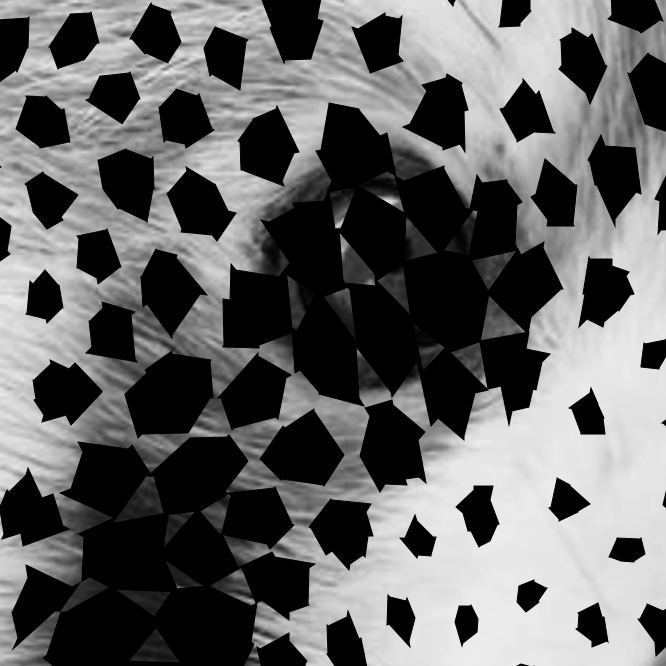

# StochasticDithering

Ma perception du "tramage aléatoire regroupé" après avoir lu le chapitre 3 de https://perso.liris.cnrs.fr/victor.ostromoukhov/publications/pdf/PhD_thesis.pdf.

# Examples

 Original| BW                                    | CMYK    |
---      | -------                               | ------- |
  |  |    |

# Les étapes

1 - Distribution aléatoire régulière de points ([un mix de poisson/bruit bleu](https://www.cs.ubc.ca/~rbridson/docs/bridson-siggraph07-poissondisk.pdf)).

2 - Sur laquelle est appliquée une triangulation de [Delaunay](https://fr.wikipedia.org/wiki/Triangulation_de_Delaunay).

3 - Est alors calculé le niveau de gris moyen (intensité de la couleur) de chaque triangle autour d'un point en fonction de l'image à tramer.

4 - Ce niveau de gris permet de calculer la taille des triangles formant la trame.

 &nbsp; 

5 - Le processus est répété pour tous les points de la distribution. 

6 - Les arêtes des triangles n'étant pas toujours bien calés autour d'un point, un post-traitement ([convex hull](https://en.wikipedia.org/wiki/Convex_hull_algorithms)) est fait pour attenuer les éventuels effets d'escalier entre triangles et ainsi obtenir des polygones plus réguliers.

Sans | Avec                                    |
---  | -------                                 |
  |  |

7 - La version CMYK reprend le même principe que la version BW. L'image couleur est d'abord décomposée en teintes Cyan, Magenta, Jaune, Noir. Chaque teinte subit une rotation spécifique avant le processus de tramage. Une image composite resultante est créée à partir des 4 teintes sur lesquelles les rotations inverses respectives ont été préalablement réalisées.

