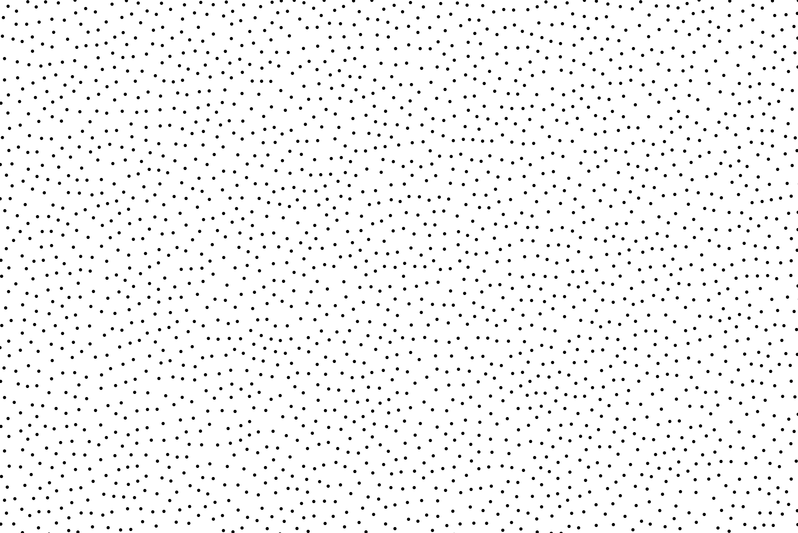
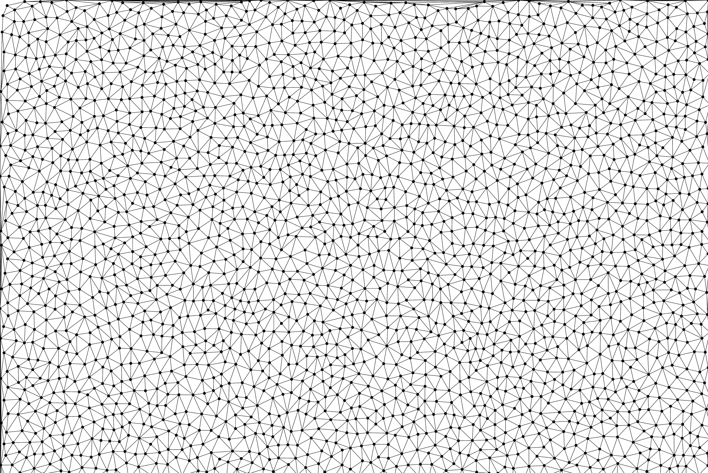

# StochasticDithering

Ma perception du "tramage aléatoire regroupé" après avoir lu le chapitre 3 de https://perso.liris.cnrs.fr/victor.ostromoukhov/publications/pdf/PhD_thesis.pdf.

# Examples

 Original| BW                                    | CMYK    |
---      | -------                               | ------- |
  |  |    |

# Les étapes

1 - Distribution aléatoire régulière de points ([un mix de poisson/bruit bleu](https://www.cs.ubc.ca/~rbridson/docs/bridson-siggraph07-poissondisk.pdf))

2 - Sur laquelle est appliquée une triangulation de [Delaunay](https://fr.wikipedia.org/wiki/Triangulation_de_Delaunay)

3 - Il faut alors calculer le niveau de gris de chaque triangle en fonction de l'image à tramer

